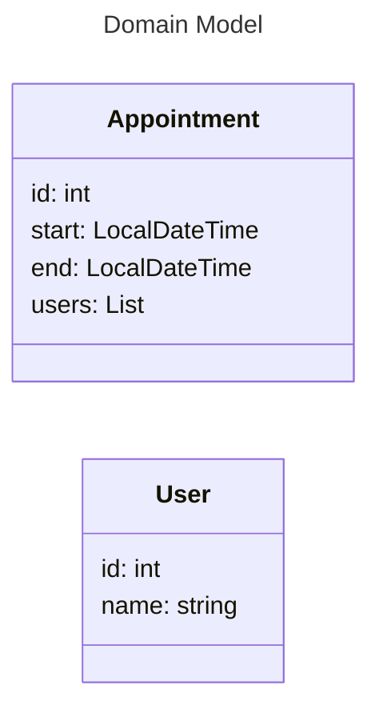

> # 🎯 ABOUT
> This is a 'best practices' template project for Spring Boot with Hexagonal Architecture. However,
> it is an opinionated take on that.
>
> DISCLAIMER: I'm by no means an expert on Spring Boot, one reason to do this is to learn it.
> Opinions are welcomed (with proper reasoning), check the [contributing] section to share your
> thoughts.
>
> The project is mirrored on [GitLab](https://gitlab.com/jaguililla/hexagonal_spring) for CI
> demonstration purposes.
>
> Have fun!

[contributing]: https://github.com/jaguililla/hexagonal_spring/contribute

# 🗓️ Appointments
Example application to create appointments (REST API). Appointments are stored in a relational DB
(Postgres), and their creation/deletion is published to a Kafka broker.

## 📘 Architecture
* [Hexagonal]/[Onion]/[Clean] Architecture
* OpenAPI code generation (server and client)

[Hexagonal]: https://alistair.cockburn.us/hexagonal-architecture
[Onion]: https://jeffreypalermo.com/2008/07/the-onion-architecture-part-1
[Clean]: https://blog.cleancoder.com/uncle-bob/2012/08/13/the-clean-architecture.html

## 🧰 Stack
* Java 25
* Spring 4 (configurable server, 'jetty' by default)
  * Actuator (healthcheck, etc.)
* Flyway (chosen over Liquibase for its simplicity)
* Postgres
* Kafka

## 🏎️ Runtime
* Cloud Native Buildpacks (building)
* Docker Compose (local environment with the infrastructure)

## 🧪 Test
* ArchUnit (preferred over Java modules: it allows naming checks, etc.)
* Testcontainers (used to provide a test instance of Postgres and Kafka)
* Pitest (mutation testing, nightly)

## ⚒️ Development
* SDKMAN (allows to use simpler runners on CI)
* Maven Wrapper (Maven can be provided by SDKMAN, however, Maven Wrapper has better IDE support)
* Editorconfig (supported by a lot of editors, rules limited though)
* CI pipelines for GitHub and GitLab

## 📑 Requirements
* Docker Compose
* JDK 25+
* SDKMAN (optional, recommended)

## 🤔 Design Decisions
* Simplicity and pragmatism over Hexagonal Architectures 'by the book'.
* Minimal: don't use libraries to implement easy stuff (even if that's boring).
* Start small, split and refactor when features are added (I.e.: split services into use cases).
* Prefer flat structure (avoid empty parent packages if possible).
* Small coupling with Spring (easier to migrate, to other frameworks/toolkits).
* Not use Spring integrations if a library can be used directly.
* No Spring profiles (settings are loaded from the environment).
* Split API spec in different files for future modularity.
* Prefer service independence over code reuse (sharing libraries among microservices).
* Docker Compose profiles are used to separate infrastructure from a complete local environment.
* Atomicity in notifiers (with outbox pattern) should be done with a different notifier adapter.
* No input ports: they don't need to be decoupled, they just use the domain (and that's acceptable).

## 📖 Architecture

* **Port**: interface to set a boundary between application logic and implementation details.
* **Adapter**: port implementation to connect the application domain with the system's context.
* **Domain**: application logic and model entities.
* **Service**: implement operations with a common topic altogether. Usually calls driven ports.
* **UseCase/Case**: single operation service (isolate features). They can coexist with services.
* **Output/Driven Adapter**: implementation of ports called from the domain.
* **Input/Driver Adapter**: commands that call application logic (don't require a port).

## 📚 Design
* The REST API controller and client are generated from the OpenAPI spec at build time.
* `domain` holds business logic (services and/or use cases) and driven ports (interfaces).
* `domain.model` keeps the structures relevant to the application's domain. The more logic added to
  an entity, the better (it could be easily accessed by many different services, or use cases).
* `notifiers` and `repositories` driven adapters (implementations of driven ports).
* `controllers` driver adapter (adapters without interface).
* Subpackages can be created for different adapter implementations (to isolate their code).
* More information about each package rules can be found on their Javadoc documentation.

## 🎚️ Set up
* With SDKMAN: `sdk env install`
* If SDKMAN is not available, JDK 21+ must be installed.

## ▶️ Commands
All commands assume a Unix like OS.

The most important commands to operate the project are:

* Build: `./mvnw package`
* Documentation: `./mvnw site`
* Run: `./mvnw spring-boot:run`
* Build image: `./mvnw verify` or `./mvnw spring-boot:build-image`

To run or deploy the application:

* Start infrastructure (for running locally): `docker-compose up -d`
* Run JAR locally: `java -jar target/appointments-0.1.0.jar`
* Run container: `docker-compose --profile local up`

## 🤖 Service Management
* You can check the API spec using [Swagger UI](http://localhost:8080/swagger-ui/index.html).

### Docker
At the `docker-compose.yml` you can find the information on how to run the application as a
container, adjusting the configuration for running it on different environments.

Two Docker compose profiles are used:
- Default profile (no profile parameter): to allow starting only the infrastructure, this is useful
  to start the application from the IDE
- Local profile (--profile local): which also starts a container using the image of this application

### Testing
The verification requests can be executed with: `src/test/resources/requests.sh`, or
`PORT=9090 src/test/resources/requests.sh` if you want to run them to a different port.

The health check endpoint is: http://localhost:18080/actuator/health

### Stress Testing (Gatling)
[Gatling settings] can be overridden creating a `gatling.conf` file at the test resources. The
configuration options and their default values can be checked [here][gatlingDefaults].

Those parameters can also be overwritten by system properties from the command line. I.e.:
`-D gatling.core.encoding=utf-8`

To run the Gatling test, execute `./mvnw -P gatling` at the shell.

[Gatling settings]: https://docs.gatling.io/reference/script/core/configuration
[gatlingDefaults]: https://github.com/gatling/gatling/blob/main/gatling-core/src/main/resources/gatling-defaults.conf

## Release
* Merges to `main` create and publish a release
* A release is a tag, a Maven package for the application, and another for the client
* Publishing is uploading the release to GitHub packages

# Security
REST API calls are secured by scopes provided in the authentication token.

These are the available scopes:
* Write
* Read
* Admin

The token should contain the principal.

Test key store password: appointments

# Security
* OpenID is used as the authentication flow
* Security logic is implemented at package `com.github.jaguililla.appointments.controllers`
* Actuator and Swagger paths are not protected
* The authenticator logic steps are:
  * On each request, the OpenID configuration (Keycloak realm) is loaded from the JWT issuer
  * Token scope is mapped to Spring Boot security model
  * `@Secure` annotation is used to enforce a scope on an endpoint

## Configuration
* For testing in a local environment the `http-server.dockerfile` container must be deployed

## Test Resources
* A test key pair was generated for tests `src/test/resources/jwt/sign.{key,pub}.pem`
* JWKS configuration (`certs.json`) generated from `sign.pub.pem`
* Testing tokens generated with method:
  `com.github.jaguililla.appointments.it.OpenIdMock.main`

## Testing
* Run project's Docker Compose as described in the [README.md] file
* Start the application from the IDE
* Sample http requests for exploratory testing are available at
  `src/test/resources/http/requests.sh` files
* On tests requests: OpenID Mock binding, token issuer and allowed issuers setting must match

[README.md]: ../README.md

# Domain Model

# Key
* appointments.p12 password: appointments
